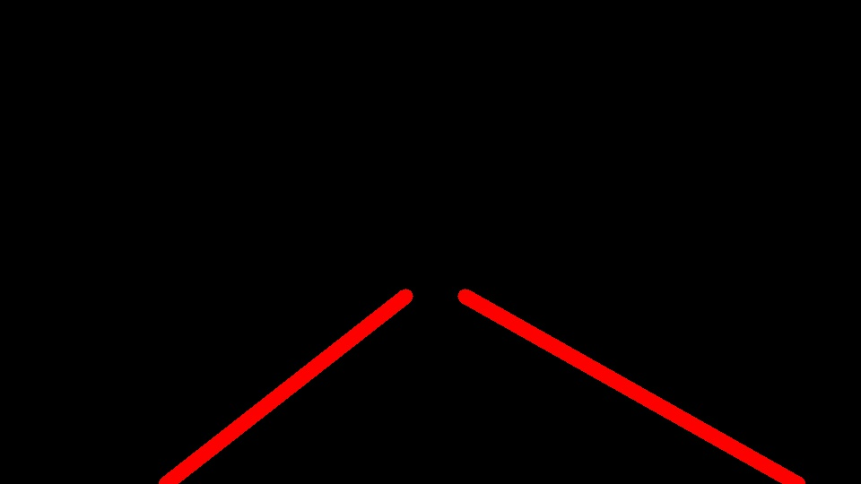

# **Finding Lane Lines on the Road**

---

The goals / steps of this project are the following:
* Make a pipeline that finds lane lines on the road
* Reflect on your work in a written report

---

### Reflection

### 1. Describe your pipeline. As part of the description, explain how you modified the draw_lines() function.

My pipeline consisted of 6 steps. First, I converted the images to grayscale, then I applied a gaussian blur with a kernal of size 5 to each image. I then performed a Canny transform on the blurred images to get the edges. After a bit of testing I decided to use a low threshold of 60 and a high threshold of 180. I then found the region that fit the lane lines and applied a mask on the Canny edge image.  I then used this masked Canny edge image and drew the hough lines. Finally, I drew the hough lines on the original image.

In order to draw a single line on the left and right lanes, I modified the draw_lines() function. The first thing I did was to separate the lines that belonged to the left lane into one group and the lines that belonged to the right lane into another group. I did this by calculating each slope. I also put a threshold on the slope to avoid horizontal lines x <= -0.3 or x >= 0.3. I then found a least squares regression line for both the left and right lines. This allowed me to then plug in the y-coordinates of the bottom left, top left, top right, and bottom right points of my region and obtain an estimated x from the linear model. So I simply used those 4 points to generate 1 line for the left lane line and one for the right lane line.

| 1. Gray Image                            | 2. Blurred Image                         | 3. Canny Edges                           |
| :--------------------------------------- | ---------------------------------------- | ---------------------------------------- |
|  |  |  |

| 4. Region of Interest                    | 5. Hough Lines                           | 6. Final Output                          |
| ---------------------------------------- | ---------------------------------------- | ---------------------------------------- |
|  |  |  |

### 2. Identify potential shortcomings with your current pipeline

One potential shortcoming would be what would happen when a valid line has a slope between -0.3 and 0.3. Right now my draw_lines() disregards those.

Another shortcoming could be when the road has many more lines in it, such as the challenge video. That requires a lot of tweaking to my constants.

### 3. Suggest possible improvements to your pipeline

A possible improvement would be to have adaptive values for the various frames in the video meaning it's not a static algorithm that just happens to work for everything. Instead it learns from the videos and adapts itself.
